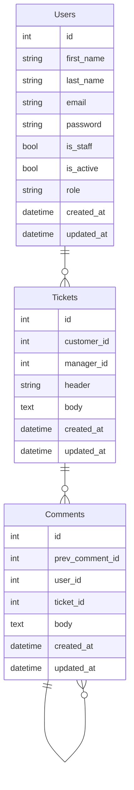
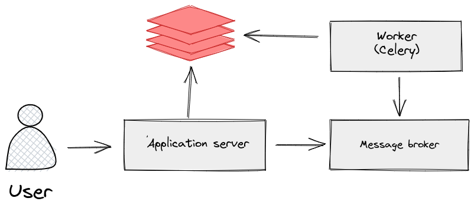

# Support service application


## Adjust the application

### Install deps

```bash
pipenv sync --dev
pipenv shell
```


## Code quality tools

- black
- flake8
- isort


## Application description
```bash
▾ users
    ├─ apps.py # Django apps configuration
    ├─ urls.py # pre-controller
    ├─ api.py # Endpoints / post-controller
    ├─ models.py # Database tables mapper
    └─ admin.py # Database tables mapper
```


# Database




## Run using Docker Compose
```bash
docker-compose up -d
```

### Useful commands
```bash
# Build images
docker-compose build

# Stop containers
docker-compose down

# Restart containers
docker-compose restart

# Check containers status
docker-compose ps


## Logs

# get all logs
docker-compose logs

# get specific logs
docker-compose logs app

# get limited logs
docker-compose logs --tail 10 app

# get flowed logs
docker-compose logs -f app
```


# Deployment process
```bash
# Clone project
git clone git@github.com:xDarkin/support_service.git

# Make a copy of .env.default file and adjust it
## name it .env

# Build image with Docker
docker-compose build

# Run containers
docker-compose up -d

# Create a superuser(admin)
python src/manage.py createsuperuser
```

# Structure diagram
